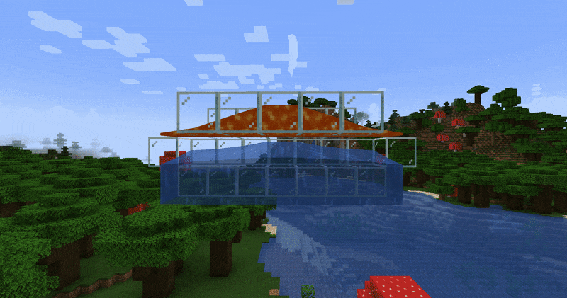

# Flowstone

Flowstone is a mod that makes ores renewable resources.

In vanilla Minecraft, lava flowing over water always generates a stone block. With Flowstone, there is a chance that it will generate a random ore block instead.

By default, all eight vanilla overworld ore blocks (coal, copper, iron, gold, lapis, redstone, emerald, and diamond) can be generated with a 1% chance each.



(In the GIF, each ore block has a 100% chance for example purposes.)

## Generators

Flowstone uses a custom `flowstone:generators` dynamic registry to determine whether and how to replace an about-to-be-generated block.

Said registry reads files from `/data/<mod id or datapack name>/flowstone/generators`, files like the following example.

<details>
<summary>Example: stone_to_coal_ore.json</summary>

```json
{
    "replace": "minecraft:stone", // The block to be replaced
    "with": "minecraft:coal_ore", // The block to replace the above one with
    "chance": 0.01 // The replacement chance
}
```

</details>

This way, through datapacks, one can easily extend Flowstone to, for instance, account for modded ores.
